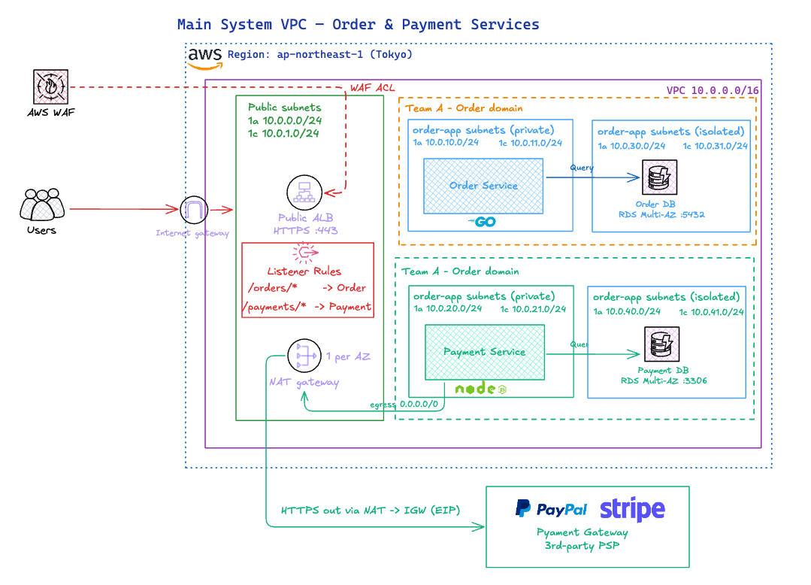

# Bài 8 — Thiết kế mạng nội bộ VPC

[Về trang tổng quan](../README.md)

Tệp: [aws_vpc_payment.excalidraw](aws_vpc_payment.excalidraw), [aws_vpc_payment.png](aws_vpc_payment.png)

## Đề bài

Công ty có 2 team hoàn toàn riêng biệt đang triển khai 2 microservice cho 1 hệ thống chung (main system):

- 2 service: order service, payment service.
- Mỗi service dùng 1 database riêng.
- Mỗi service có thể code bằng ngôn ngữ khác nhau.
- Hệ thống được sử dụng trong nội địa Nhật Bản.

Yêu cầu: vẽ sơ đồ mạng nội bộ (VPC, route table, subnet, NAT, NACL, ...), chỉ ra các thông số, region, AZ.

## Sơ đồ

Mở [aws_vpc_payment.excalidraw](aws_vpc_payment.excalidraw) bằng [excalidraw.com](https://excalidraw.com) hoặc extension Excalidraw trong VS Code để chỉnh sửa.

## Thông số

| Thành phần | Giá trị |
|---|---|
| Region | `ap-northeast-1` (Tokyo) — dữ liệu nằm trong Nhật Bản |
| AZ | `ap-northeast-1a`, `ap-northeast-1c` |
| VPC | `10.0.0.0/16` |
| Public subnet (ALB, NAT) | 1a `10.0.0.0/24`, 1c `10.0.1.0/24` |
| order-app (private) | 1a `10.0.10.0/24`, 1c `10.0.11.0/24` — Order Service (Go) |
| order-db (isolated) | 1a `10.0.30.0/24`, 1c `10.0.31.0/24` — RDS Multi-AZ `:5432` |
| payment-app (private) | 1a `10.0.20.0/24`, 1c `10.0.21.0/24` — Payment Service (Node.js) |
| payment-db (isolated) | 1a `10.0.40.0/24`, 1c `10.0.41.0/24` — RDS Multi-AZ `:3306` |
| NAT Gateway | 1 NAT mỗi AZ, có Elastic IP |
| WAF | Gắn vào ALB, geo-match chỉ cho phép JP |

### Route table

| Route table | Route |
|---|---|
| `rtb-public` | `0.0.0.0/0` → IGW |
| `rtb-app-1a` / `rtb-app-1c` | `0.0.0.0/0` → NAT cùng AZ |
| `rtb-db` | Chỉ `local`, không ra internet |
| Tất cả | `10.0.0.0/16` → `local` |

### NACL (mỗi tầng subnet một NACL)

- `nacl-public`: inbound 443 từ `0.0.0.0/0`, outbound ephemeral `1024-65535`.
- `nacl-order`: chỉ nhận từ public subnet và payment-app.
- `nacl-payment`: chỉ nhận từ public subnet và order-app.
- `nacl-db-*`: chỉ nhận cổng DB (`5432` / `3306`) từ app subnet của chính team đó.

### Security group

- `sg-alb`: 443 từ `0.0.0.0/0`.
- `sg-order`, `sg-payment`: cổng app chỉ từ `sg-alb`; `sg-payment` nhận thêm `8443` từ `sg-order`.
- `sg-order-db`, `sg-payment-db`: cổng DB chỉ từ SG app của team mình.

Payment Service gọi cổng thanh toán bên ngoài (PayPal, Stripe) qua NAT → IGW.
